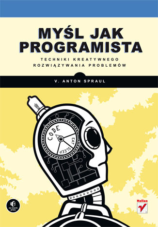

# kata-cpp

_Kolekcja krótkich programów, struktur danych, algorytmów zaimplementowanych w języku C++._

Myśl jak programista, Spraul Anton V. - zadania
--------------------------------------------------------

### Rozdziały

00. Wstęp.
01. Strategie rozwiązywania problemów.
    + [Algorytm Luhna. Generowanie sumy kontrolnej](./think-like-a-programmer/r02/algorytm-luhna.cpp),
    + [Algorytm dekodowania zaszyfrowanej wiadomości](./think-like-a-programmer/r02/dekodowanie-wiadomosci.cpp),
    + [Algorytm zamiany liczb dziesiętnych na binarne](./think-like-a-programmer/r02/dziesietne-na-binarne.cpp),
    + [Trójkąt równoramienny](./think-like-a-programmer/r02/rysunek1.cpp),
    + [Trójkąt prostokątny](./think-like-a-programmer/r02/rysunek2.cpp),
    + [Kwadrat](./think-like-a-programmer/r02/rysunek3.cpp),
    + [Doniczka](./think-like-a-programmer/r02/rysunek4.cpp).
